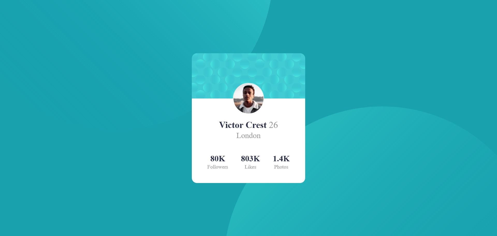

# Frontend Mentor - Profile card component solution

This is a solution to the [Profile card component challenge on Frontend Mentor](https://www.frontendmentor.io/challenges/profile-card-component-cfArpWshJ). Frontend Mentor challenges help you improve your coding skills by building realistic projects. 

## Table of contents

- [Overview](#overview)
  - [The challenge](#the-challenge)
  - [Screenshot](#screenshot)
  - [Links](#links)
- [My process](#my-process)
  - [Built with](#built-with)
  - [What I learned](#what-i-learned)
- [Author](#author)


## Overview

### The challenge

- Build out the project to the designs provided

### Screenshot




### Links

- Solution URL: [My Solution](https://github.com/shashikantdev3/FrontendMentor-profile-card-component-main)
- Live Site URL: [Live Preview](https://shashikantdev3.github.io/FrontendMentor-profile-card-component-main/)

## My process

### Built with

- Semantic HTML5 markup
- CSS custom properties
- Flexbox
- CSS Grid
- Mobile-first workflow

### What I learned

In this project I have learned how to embed a svg image at 45vw and 45vh on background, below is the CSS code for it.

To see how you can add code snippets, see below:

```css

body{
  background-image: url(./images/bg-pattern-top.svg),
                    url(./images/bg-pattern-bottom.svg);
  background-repeat: no-repeat;
  background-size: cover;
  background-position: right 45vw bottom 45vh, 45vw 45vh;
}

```

## Author

- Website - [Shashikant](https://www.your-site.com)
- Frontend Mentor - [@shashikantdev3](https://www.frontendmentor.io/profile/shashikantdev3)
- Twitter - [@shashikantdev3](https://www.twitter.com/shashikantdev3)
